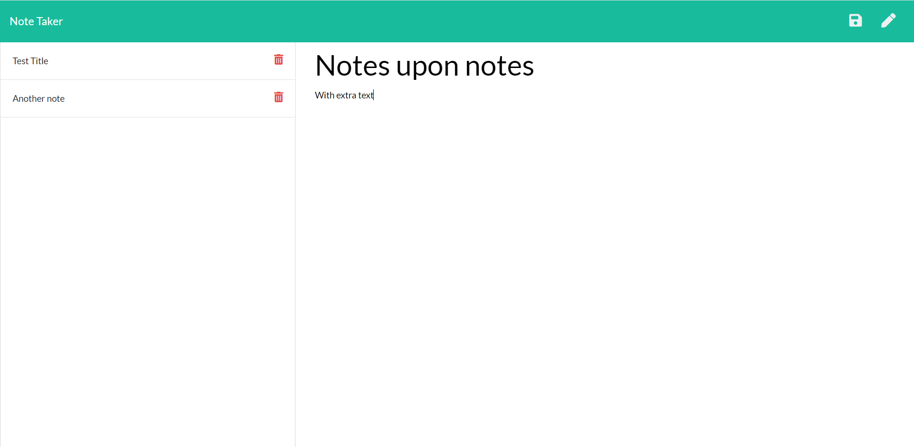

# Title

Express Note-taking Application

This application allows the user to create, save, delete, and view previous notes through a single webpage

# Installation

A live deployment can be found here: <a href="https://express-notetaker-app109.herokuapp.com/notes">https://express-notetaker-app109.herokuapp.com/notes</a>

To use locally use the following steps.

<ol>
    <li>Download the files from Github</li>
    <li>Install and setup Node.js</li>
    <li>Open the downloaded files with VS code.</li>
    <li>Open the terminal while viewing the files (CTRL + `)</li>
    <li>Run the command npm install in your terminal</li>
    <li>Open the index.html file with a browser</li>
</ol>

## Built With
<ul>
<li>Bootstrap - CDN included</li>
<li>jQuery - CDN included</li>
<li>Node.js and the following packages</li>
<ul>
<li>Body-parser - Installed via Node</li>
<li>Express - Installed via Node</li>
<li>fs - Installed via Node</li>
</ul>
</ul>

## Code Overview

The original page is created by the public/index.html file and styled with the included public/assets/css/styles.css file along with Bootstrap. When start is clicked the user is redirected to the public/notes.html page using the routes/htmlroutes.js via the server.js file where notes can be created. When the user chooses to create their first note, the public/assets/js/index.js JavaScript tells the fs npm package to write their input to the db/db.json file via an API route (routes/apiroutes) from the server (no a relational database). The new note then has it's title displayed on the left side and when the user views said note the index.js file changes the previous writing area into a viewing area, then back when finished. When the user chooses to delete a note the index.js file tells the fs node package to find the note with that id via api routing and delete it from the db.json file.
